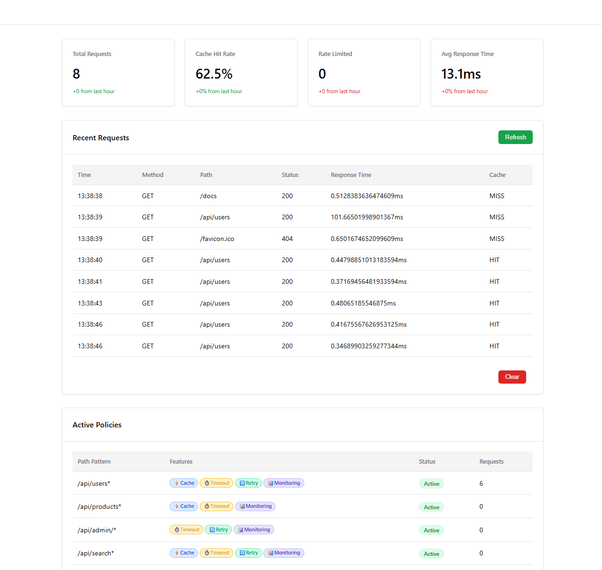

# Premier

[](https://badge.fury.io/py/premier)
[](https://pypi.org/project/premier/)
[](https://github.com/raceychan/premier/blob/master/LICENSE)

---

Premier is a versatile Python toolkit that can be used in three main ways:

1. **Lightweight Standalone API Gateway** - Run as a dedicated gateway service
2. **ASGI App/Middleware** - Wrap existing ASGI applications or add as middleware
3. **Decorator Mode** - Use Premier decorators directly on functions for maximum flexibility

Premier transforms any Python web application into a full-featured API gateway with caching, rate limiting, retry logic, timeouts, and performance monitoring.

Premier comes with a nice dashboard for you to monitor your requests



## Features

Premier provides enterprise-grade API gateway functionality with:

- **API Gateway Features** - caching, rate limiting, retry logic, and timeout, etc.
- **Path-Based Policies** - Different features per route with regex matching
- **Load Balancing & Circuit Breaker** - Round robin load balancing with fault tolerance
- **WebSocket Support** - Full WebSocket proxying with rate limiting and monitoring
- **Web Dashboard** - Built-in web GUI for monitoring and configuration management
- **YAML Configuration** - Declarative configuration with namespace support

... and more

## Why Premier

Premier is designed for **simplicity and accessibility** - perfect for simple applications that need API gateway functionality without introducing complex tech stacks like Kong, Ambassador, or Istio.

**Key advantages:**

- **Zero Code Changes** - Wrap existing ASGI apps without modifications
- **Simple Setup** - Single dependency, no external services required
- **Dual Mode Operation** - Plugin for existing apps OR standalone gateway
- **Python Native** - Built for Python developers, integrates seamlessly
- **Lightweight** - Minimal overhead, maximum performance
- **Hot Reloadable** - Update configurations without restarts

## Quick Start

### Plugin Mode (Recommended)

**How it works:** Each app instance has its own Premier gateway wrapper

```
┌─────────────────────────────────────────────────────────────┐
│ App Instance 1                                              │
│ ┌─────────────────┐    ┌─────────────────────────────────┐  │
│ │   Premier       │────│       Your ASGI App             │  │
│ │   Gateway       │    │     (FastAPI/Django/etc)        │  │
│ │  ┌──────────┐   │    │                                 │  │
│ │  │Cache     │   │    │  @app.get("/api/users")         │  │
│ │  │RateLimit │   │    │  async def get_users():         │  │
│ │  │Retry     │   │    │      return users               │  │
│ │  │Timeout   │   │    │                                 │  │
│ │  └──────────┘   │    │                                 │  │
│ └─────────────────┘    └─────────────────────────────────┘  │
└─────────────────────────────────────────────────────────────┘
```

You can keep your existing app.py file untouched

```python
# app.py
from premier.asgi import ASGIGateway, GatewayConfig
from fastapi import FastAPI

# Your existing app - no changes needed
app = FastAPI()

@app.get("/api/users/{user_id}")
async def get_user(user_id: int):
    return await fetch_user_from_database(user_id)
```

Next, import your app instance and wrap it with ASGIGateway:

```python
# gateway.py
from .app import app
# Load configuration and wrap app
config = GatewayConfig.from_file("gateway.yaml")
app = ASGIGateway(config=config, app=app)
```

Then, instead of serving the original app directly, serve the one wrapped with ASGIGateway.

### Standalone Mode

**How it works:** Single gateway handles all requests and forwards to backend services

```
                        ┌─────────────────────┐
    Client Request      │   Premier Gateway   │
         │              │  ┌──────────────┐   │
         │              │  │ Cache        │   │
         └──────────────►  │ RateLimit    │   │
                        │  │ Retry        │   │
                        │  │ Timeout      │   │
                        │  │ Monitoring   │   │
                        │  └──────────────┘   │
                        └─────┬──────┬────────┘
                              │      │
                    ┌─────────┘      └─────────┐
                    ▼                          ▼
            ┌───────────────┐          ┌───────────────┐
            │   Backend 1   │          │   Backend 2   │
            │ (Any Service) │          │ (Any Service) │
            │               │          │               │
            │ Node.js API   │          │  Python API   │
            │ Java Service  │          │  .NET Service │
            │ Static Files  │          │  Database     │
            └───────────────┘          └───────────────┘
```

```python
# main.py
from premier.asgi import ASGIGateway, GatewayConfig

config = GatewayConfig.from_file("gateway.yaml")
gateway = ASGIGateway(config, servers=["http://backend:8000"])
```

```bash
uvicorn src:main
```

### Decorator Mode

**How it works:** Apply Premier features directly to individual functions with decorators - no ASGI app required

For detailed examples and tutorials, see the [Examples page](examples.md).

## Requirements

- Python >= 3.10
- Redis >= 5.0.3 (optional, for distributed deployments)
- PyYAML (for YAML configuration)
- aiohttp (optional, for standalone mode)

## Next Steps

- [Installation Guide](installation.md) - Install Premier in your project
- [Configuration Reference](configuration.md) - Complete configuration documentation
- [Web Dashboard](web-gui.md) - Monitor and manage your gateway
- [Examples](examples.md) - Complete examples and tutorials

## License

MIT License